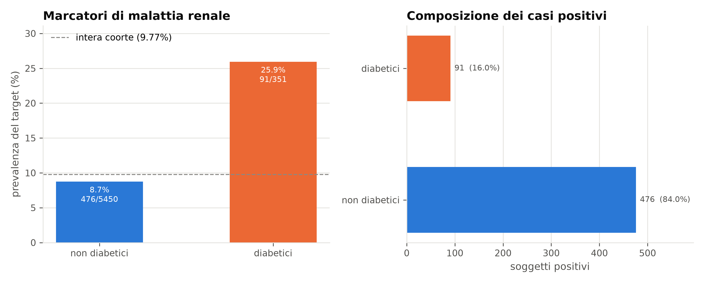
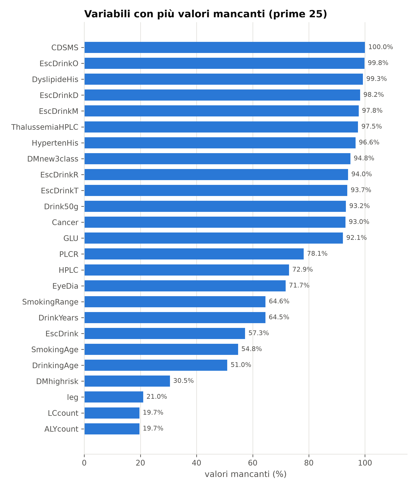
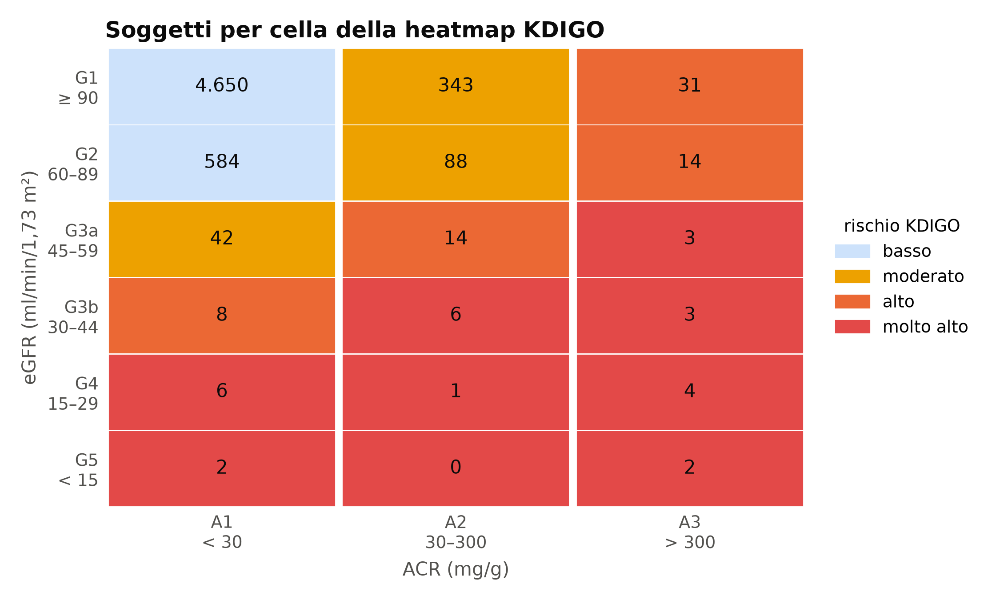
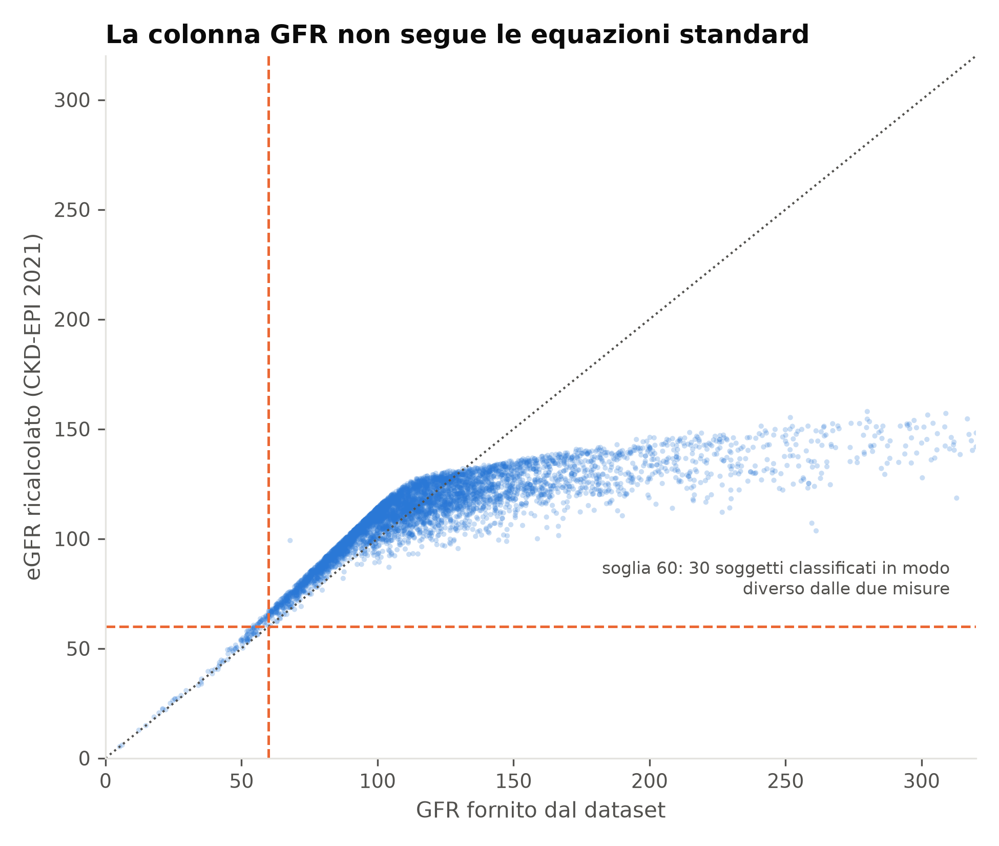
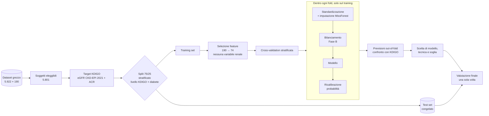
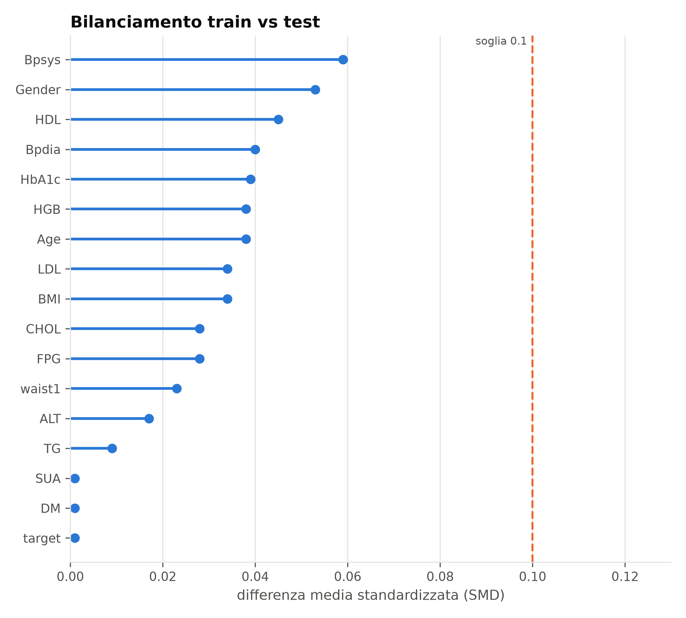
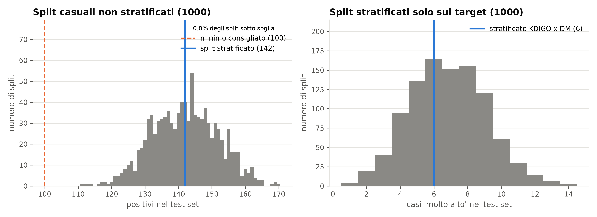
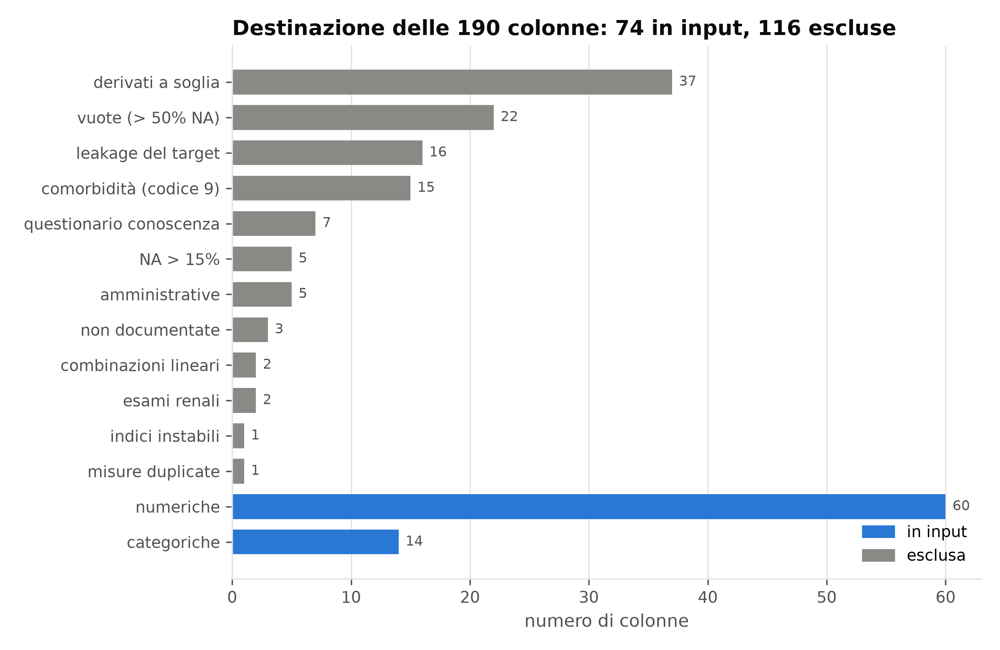
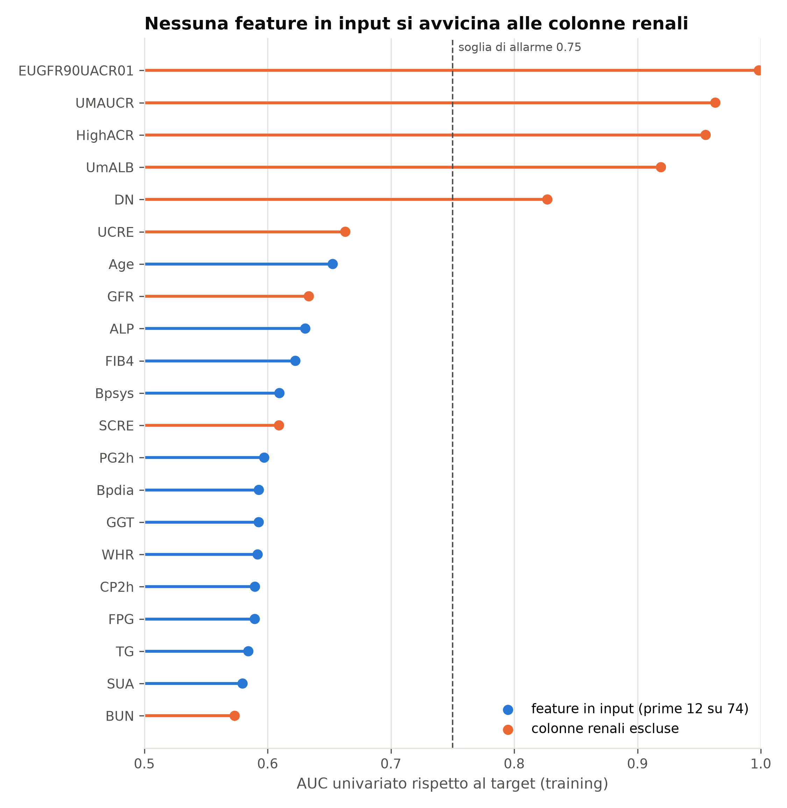
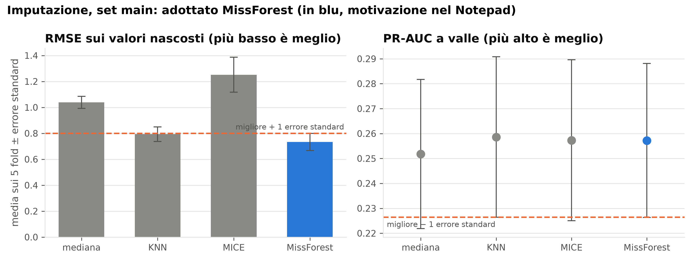

<div align="center">

# K-Risk

### Screening dei marcatori di malattia renale cronica senza esami renali

*Pipeline di machine learning riproducibile per stimare il rischio renale da dati di screening metabolico, confrontata con la stratificazione clinica KDIGO e con tecniche di data augmentation per classi sbilanciate.*

[](https://www.python.org/downloads/)
[](https://scikit-learn.org/)
[](tests/)
[](LICENSE)
[](https://creativecommons.org/licenses/by/4.0/)
[](#-stato-di-avanzamento)

Progetto di tesi di laurea triennale · Francesco Coppola

</div>

---

## Indice

1. [In breve](#-in-breve)
2. [Motivazione clinica](#-motivazione-clinica)
3. [Domande di ricerca](#-domande-di-ricerca)
4. [Dati](#-dati)
5. [Definizione del target](#-definizione-del-target)
6. [Architettura della pipeline](#-architettura-della-pipeline)
7. [Metodologia](#-metodologia)
8. [Risultati preliminari](#-risultati-preliminari)
9. [Stato di avanzamento](#-stato-di-avanzamento)
10. [Riproducibilità](#-riproducibilità)
11. [Struttura del repository](#-struttura-del-repository)
12. [Limiti dichiarati](#-limiti-dichiarati)
13. [Citazione e licenza](#-citazione-e-licenza)

---

## 🔎 In breve

K-Risk allena modelli di classificazione che, **senza usare esami renali**, stimano quali soggetti presentano marcatori di malattia renale cronica (CKD) secondo i criteri **KDIGO**. Le stime vengono poi confrontate con la stratificazione clinica del rischio, e si misura quanto le tecniche di **data augmentation** (undersampling, oversampling, SMOTE, CTGAN) migliorano il riconoscimento dei casi più gravi.

| | |
|---|---|
| **Popolazione** | 5.801 soggetti di uno screening metabolico di popolazione (Cina, 2012) |
| **Input** | 74 variabili di screening: anagrafica, antropometria, pressione, glicemia, lipidi, emocromo, anamnesi, stili di vita |
| **Escluse** | tutte le variabili renali (creatinina, ACR, albuminuria, azotemia, eGFR e derivati) |
| **Target** | binario: `ACR ≥ 30 mg/g` oppure `eGFR < 60 ml/min/1,73 m²` (eGFR ricalcolato con CKD-EPI 2021) |
| **Prevalenza** | 567 positivi su 5.801 (**9,77%**): classi sbilanciate |
| **Valutazione** | AUC, PR-AUC, sensibilità per livello KDIGO, concordanza con la stratificazione clinica |

Il contributo non è un nuovo algoritmo, ma una **pipeline completa, riproducibile e metodologicamente rigorosa**: ogni scelta è motivata, confrontata con alternative in cross-validation e documentata.

---

## 🩺 Motivazione clinica

La malattia renale cronica è spesso **asintomatica fino a stadi avanzati** e si diagnostica con due esami specifici: la creatinina sierica (da cui si stima il filtrato, eGFR) e il rapporto albumina/creatinina urinaria (ACR). Nelle persone con diabete le linee guida prescrivono questi esami ogni anno; nella **popolazione generale** invece non vengono eseguiti di routine.

La domanda di K-Risk è quindi: **con i soli dati di uno screening metabolico standard, è possibile stabilire a chi dare la priorità per gli esami renali?** Un modello di questo tipo non sostituisce gli esami: aiuta a indirizzarli.

---

## ❓ Domande di ricerca

Le prime quattro domande valgono per i modelli sui dati originali (Fase A) e, identiche, per ogni tecnica di bilanciamento (Fase B).

| # | Domanda | Come si misura |
|---|---------|----------------|
| 1 | Il modello distingue chi ha marcatori di malattia renale? | AUC, PR-AUC, precision, recall |
| 2 | Il rischio stimato cresce con la gravità KDIGO? | probabilità per livello, test di tendenza |
| 3 | Quanti casi "alto" e "molto alto" riconosce? | sensibilità per livello (mancare un "molto alto" è l'errore più grave) |
| 4 | Le fasce di rischio del modello corrispondono alla stratificazione clinica? | concordanza con i livelli KDIGO |
| 5 | L'augmentation migliora il riconoscimento dei casi gravi o solo la metrica media? | confronto fra tecniche sulle domande 1–4 |
| 6 | Come si comporta il modello nel sottogruppo diabetico (91 casi)? | risultati descrittivi |

---

## 📊 Dati

Dataset pubblico **A bimodal dataset for diabetes research** (Li et al., *Scientific Data*, 2026), incluso senza modifiche in [`data/raw/`](data/raw/) con licenza CC BY 4.0. Fonte, dizionario delle variabili e checksum sono in [`data/README.md`](data/README.md).

- **5.922 soggetti, 190 variabili**, una sola misurazione per soggetto (dati trasversali)
- **5.801 soggetti utilizzabili**: quelli con creatinina sierica e ACR misurate, necessarie per calcolare il target
- sottogruppo diabetico: **351 soggetti, 91 positivi**, in cui il target coincide con la definizione di malattia renale nel diabete (DKD)

<p align="center">
  
  
</p>

---

## 🎯 Definizione del target

```
y = 1   se   ACR ≥ 30 mg/g   oppure   eGFR < 60 ml/min/1,73 m²
y = 0   altrimenti
```

L'eGFR è **ricalcolato con l'equazione CKD-EPI 2021**, raccomandata da KDIGO: la colonna `GFR` del dataset non corrisponde a nessuna equazione standard (CKD-EPI 2009/2021, MDRD, MDRD cinese, Cockcroft-Gault) e contiene valori fuori scala.

Incrociando le categorie di eGFR (G1–G5) e di ACR (A1–A3) si ottiene la **mappa di rischio KDIGO** a quattro livelli. I livelli **non vengono usati per allenare** i modelli, ma per valutarli.

| Livello KDIGO | Soggetti | Target |
|---------------|---------:|:------:|
| basso | 5.234 | 0 |
| moderato | 473 | 1 |
| alto | 67 | 1 |
| molto alto | 27 | 1 |

<p align="center">
  
  
</p>

**Perché una classificazione e non una regressione sull'ACR:** l'ACR ha una distribuzione fortemente asimmetrica, le tecniche di augmentation da confrontare sono pensate per la classificazione e KDIGO è già, per costruzione, una classificazione.

---

## 🏗️ Architettura della pipeline



Il principio guida è l'**assenza di data leakage**: ogni trasformazione che impara dai dati (imputazione, scaling, bilanciamento, generatori sintetici) è stimata **solo sul training di ogni fold**, e il test set viene letto una sola volta, alla fine.

---

## 🔬 Metodologia

### 1. Split train/test

- **75/25**, seed fisso (`42`), stratificato sulla combinazione **livello KDIGO × diabete**: i pochi casi "molto alto" e i diabetici sono distribuiti in proporzione in entrambi i set
- training: 4.350 soggetti · test: 1.451 soggetti
- equilibrio verificato con la **differenza media standardizzata (SMD)** su 15 variabili cliniche e con una simulazione su 1.000 split casuali, per mostrare che la stratificazione riduce la variabilità del numero di casi gravi nel test

<p align="center">
  
  
</p>

### 2. Selezione delle feature: da 190 a 74

Ogni colonna del dataset appartiene a **esattamente un gruppo**, dichiarato in [`configs/config.yaml`](configs/config.yaml) e verificato dai test automatici. Nessuna colonna viene esclusa senza un motivo esplicito.

| Gruppo escluso | Esempi | Motivo |
|----------------|--------|--------|
| leakage del target | `SCRE`, `UMAUCR`, `GFR`, `DN` | il target è calcolato da queste colonne |
| esami renali | `BUN`, `RF` | violano il vincolo "senza esami renali" |
| amministrative / non documentate | `NO`, `Data`, `VAR00001` | nessun significato clinico |
| vuote (> 50% NA) | `CDSMS`, `GLU`, `HPLC` | l'imputazione inventerebbe la maggior parte dei valori |
| derivate a soglia | `BMI25`, `Anemia`, `FPGover7` | ricodifiche di variabili già presenti |
| comorbidità con codice 9 | `Angina`, `MI`, `HF` | dopo la ricodifica di "sconosciuto" > 15% NA e nessun segnale |
| indici instabili | `Homaβ` | formula con denominatore `FPG − 3,5`: esplode sopra 1000 |
| > 15% NA sul training | `LC`, `ALY` | soglia di mancanti fissata a priori |

**Risultato:** 74 feature (60 numeriche + 14 categoriche). Un secondo set, **`no_consequence`** (67 feature), toglie le variabili che la malattia renale altera (emoglobina, ematocrito, acido urico, albumina…) ed è usato come **analisi di sensibilità**: serve a verificare che il modello non riconosca la malattia dalle sue conseguenze.

Come controllo anti-leakage, l'AUC univariata di ogni feature finale è confrontata con quella delle variabili renali escluse: nessuna feature in input si avvicina al loro potere discriminante.

<p align="center">
  
  
</p>

### 3. Codifiche e trasformazioni

- **categoriche**: codifica senza one-hot (binarie 0/1, ordinali 0/1/2 per fumo, alcol, tè), imputazione con la **moda**
- **numeriche**: standardizzazione, poi imputazione con **MissForest** (lo stesso ordine per tutti i candidati del confronto, perché KNN e MICE lavorano su distanze e regressioni)
- **nessuna trasformazione logaritmica**: testata sulle 25 variabili con asimmetria > 2, guadagno di PR-AUC **+0,008 ± 0,005** (non significativo, t ≈ 1,5). Si mantiene la scala clinica, più leggibile per odds ratio e SHAP
- **valori estremi tenuti**: clinicamente possibili e presenti in uno screening reale; toglierli solo dal training renderebbe il modello impreparato sul test

### 4. Scelta del metodo di imputazione

Il 38% dei soggetti del training ha almeno un valore mancante: eliminare le righe incomplete distruggerebbe oltre un terzo del campione. Quattro metodi, in ordine di complessità, sono stati confrontati in **cross-validation a 5 fold** stratificata sul livello KDIGO, con due criteri:

- **(a) ricostruzione**: si nasconde il 10% dei valori osservati e si misura l'errore (RMSE in unità standardizzate)
- **(b) prestazioni a valle**: regressione logistica fissa usata come strumento di misura (PR-AUC)

| Metodo | RMSE ↓ | PR-AUC ↑ | AUC | Tempo |
|--------|-------:|---------:|----:|------:|
| Mediana | 1,038 ± 0,047 | 0,252 ± 0,030 | 0,693 | 1 s |
| KNN (k = 5) | 0,793 ± 0,057 | 0,259 ± 0,032 | 0,695 | 11 s |
| MICE | 1,252 ± 0,135 | 0,257 ± 0,032 | 0,697 | 70 s |
| **MissForest** | **0,734 ± 0,066** | **0,257 ± 0,031** | **0,696** | **305 s** |

*Set principale, media ± errore standard sui fold. Ogni imputer usa come predittori anche le variabili categoriche (es. `DM` per stimare `HbA1c`).*

**Regola di scelta in due fasi**, derivata dalla regola di 1 errore standard (Hastie, Tibshirani & Friedman 2009): si tengono i metodi con PR-AUC entro 1 SE dal migliore, poi fra questi il più semplice con RMSE entro 1 SE dal migliore.

Cosa emerge:
- **a valle i quattro metodi sono indistinguibili** (PR-AUC 0,252–0,259, errore standard ~0,03)
- **la mediana è esclusa**: non ricostruisce nulla (RMSE ~1, come prevedere la media) e assegna lo **stesso valore** a tutti i mancanti. I 397 soggetti senza `HbA1c` ricevono tutti 5,5, diabetici compresi. In Fase B questi picchi artificiali verrebbero moltiplicati da SMOTE e appresi da CTGAN come parte della distribuzione
- **MICE è escluso**: estrapolazioni estreme sulle variabili asimmetriche (RMSE instabile)
- **KNN e MissForest sono al margine della regola**: KNN rientra nella soglia sul set principale (0,793 contro 0,800) e ne esce nel set di sensibilità. La regola, basata su errori standard non appaiati, qui non separa i due metodi
- il **confronto appaiato** (stessi fold, stessi valori nascosti), che è il confronto corretto fra metodi valutati sugli stessi dati (Nadeau & Bengio 2003), è invece netto e stabile: MissForest ricostruisce meglio **in tutti i fold di entrambi i set** (RMSE +0,060 ± 0,010 per KNN), con prestazioni a valle equivalenti

**Metodo scelto: MissForest**, per entrambi i set di feature e per entrambe le fasi. Oltre al confronto appaiato, lo motivano quattro ragioni:
- la **letteratura clinica**: MissForest ha l'errore di imputazione più basso di KNN e MICE su dati misti, di laboratorio e di diabete (Stekhoven & Bühlmann 2012; Waljee et al. 2013; Tiwaskar et al. 2025)
- la **Fase B**: SMOTE interpola fra casi vicini e CTGAN impara la distribuzione congiunta, quindi servono valori imputati fedeli e correlazioni conservate
- la **coerenza con le altre scelte**: niente logaritmo e valori estremi tenuti. Gli alberi sono insensibili ad asimmetria e valori estremi, le distanze di KNN no
- l'**analisi di sensibilità**: stesso imputer per entrambi i set di feature, così i risultati differiscono solo per le variabili tolte

La scelta è stata fatta dopo aver visto i risultati ed è dichiarata come tale. Il rischio è limitato: a valle i metodi sono equivalenti, e in Fase B è prevista un'analisi di sensibilità con KNN. Il costo (circa 5 minuti) si paga una volta per fold: i dati imputati vengono salvati e riusati per tutti i modelli e le tecniche di bilanciamento. L'imputer non vede mai il target, quindi il riuso non introduce leakage. Storia completa della decisione in [`Notepad.md`](Notepad.md), Passi 4–10.

<p align="center">
  
</p>

### 5. Modelli e tecniche di bilanciamento

| Fase | Contenuto |
|------|-----------|
| **A — dati originali** | cinque modelli, uno per ruolo: classificatore di maggioranza (soglia minima), regressione logistica con i predittori del punteggio clinico SCORED (Bang et al. 2007), regressione logistica penalizzata, Random Forest, XGBoost. Cross-validation annidata, stesso budget di ottimizzazione per tutti |
| **B — bilanciamento** | gli stessi cinque modelli con: nessuna correzione, pesi di classe, undersampling, oversampling, SMOTE, CTGAN (anche condizionato al livello KDIGO) |
| **C — conclusioni** | confronto fra tecniche, analisi del sottogruppo diabetico |

### 6. Regole metodologiche

- augmentation **solo sul training e dentro ogni fold**: i dati sintetici non finiscono mai in validazione o nel test
- **ricalibrazione** delle probabilità dopo il bilanciamento, che le distorce; si riportano anche metriche basate sull'ordinamento, immuni alla distorsione
- confronto con KDIGO **solo su soggetti reali**: i sintetici non hanno un livello KDIGO
- analisi per livello sulle previsioni **out-of-fold** del training (50 "alto", 21 "molto alto"), conferma sul test (17 e 6)
- **test set usato una volta sola**: scelte di modello, tecnica e soglia si fanno in cross-validation

---

## 📈 Risultati preliminari

> I risultati definitivi dei modelli (Fasi A–C) sono in fase di sviluppo. Quelli che seguono vengono dal confronto dei metodi di imputazione, dove una regressione logistica fissa fa da strumento di misura.

- con una semplice regressione logistica e **nessuna variabile renale**, la PR-AUC in cross-validation è **~0,25**, cioè **circa 2,6 volte** la prevalenza (9,77%, valore atteso di un classificatore casuale); l'AUC è **~0,69**
- togliendo le 7 variabili alterate dalla malattia renale (set `no_consequence`) la PR-AUC scende di circa 0,01 (0,257 → 0,246 con MissForest), ben dentro l'errore standard (~0,03): **il segnale non dipende dalle conseguenze della malattia**
- nessun segno di leakage residuo: la migliore feature da sola ha AUC 0,65 (soglia di allarme univariata 0,75) e il modello completo resta intorno a 0,69 (soglia di allarme 0,9)

---

## 🗺️ Stato di avanzamento

- [x] Acquisizione del dataset e verifica di integrità (checksum)
- [x] Ricalcolo dell'eGFR (CKD-EPI 2021) e classificazione KDIGO
- [x] Split train/test stratificato e verifica di bilanciamento
- [x] Selezione delle feature con esclusione documentata di ogni colonna
- [x] Confronto dei metodi di imputazione in cross-validation (mediana, KNN, MICE, MissForest)
- [x] Scelta motivata dell'imputer (MissForest)
- [x] Test automatici su split e preprocessing
- [ ] **Fase A** — modelli sui dati originali e confronto con KDIGO
- [ ] **Fase B** — tecniche di bilanciamento e data augmentation (SMOTE, CTGAN)
- [ ] **Fase C** — conclusioni e analisi del sottogruppo diabetico
- [ ] Interpretabilità (SHAP, coefficienti)
- [ ] Valutazione finale sul test set
- [ ] Prototipo dimostrativo

---

## ⚙️ Riproducibilità

### Ambiente

```bash
git clone https://github.com/KekkoCoppola/K-Risk.git
cd K-Risk
python -m venv .venv
source .venv/bin/activate   # Windows: .venv\Scripts\activate
pip install -r requirements-lock.txt
```

Testato con **Python 3.12.10** su **Windows 11**. [`requirements-lock.txt`](requirements-lock.txt) fissa le versioni esatte usate per produrre i risultati; [`requirements.txt`](requirements.txt) elenca le dipendenze dirette con le versioni minime.

### Esecuzione

```bash
python -m src.data.split                      # split train/test in data/processed/
python -m src.analytics.dataset_overview      # figure in analytics/dataset/
python -m src.analytics.split_report          # figure in analytics/split/
python -m src.data.imputation                 # confronto imputazione (~10 min, MissForest è il più lento)
python -m src.analytics.preprocessing_report  # figure in analytics/preprocessing/
python -m src.data.imputed                    # fold imputati per la CV annidata (~1 ora, una volta sola)
python -m src.models.phase_a                  # Fase A: 5 modelli, CV annidata, Optuna (diverse ore; riprende da dove si è fermata)
python -m src.models.evaluation               # valutazione Fase A sulle previsioni out-of-fold (~2 min), tabelle in analytics/phase_a/evaluation/
python -m src.models.interpretation           # odds ratio delle logistiche e SHAP di Random Forest e XGBoost (~5 min)
python -m src.analytics.phase_a_report        # figure della valutazione e dell'interpretazione Fase A in analytics/phase_a/
python -m src.models.phase_a --sensitivity depth_1_12       # analisi di sensibilità: XGBoost con max_depth 1-12 (~45 min)
python -m src.models.evaluation --sensitivity depth_1_12    # sua valutazione, confrontata con i modelli primari
python -m pytest                              # test automatici
```

### Garanzie di riproducibilità

- **un solo file di configurazione** ([`configs/config.yaml`](configs/config.yaml)): percorsi, seed, soglie cliniche, gruppi di feature, parametri di imputazione
- **seed fisso** in ogni passaggio casuale
- **dati grezzi versionati** e mai modificati; tutto ciò che è derivato si rigenera dai comandi sopra
- **test automatici** che verificano, tra l'altro: assenza di sovrapposizioni fra train e test, stratificazione, assenza di colonne renali o con codice 9 in input, copertura completa delle colonne nei gruppi di feature, regola di scelta dell'imputazione
- **registro delle decisioni** in [`Notepad.md`](Notepad.md): ogni scelta con verifiche, numeri e motivazioni; lo scope del progetto è in [`Scope.md`](Scope.md)

---

## 🗂️ Struttura del repository

```
K-Risk/
├── analytics/                 figure e tabelle generate
│   ├── dataset/               esplorazione del dataset e del target
│   ├── split/                 verifica dello split train/test
│   ├── preprocessing/         selezione feature e confronto imputazione
│   └── phase_a/               Fase A: previsioni out-of-fold, tabelle di valutazione (evaluation/), figure
├── configs/
│   └── config.yaml            unica fonte di configurazione
├── data/
│   ├── raw/                   dataset originale (CC BY 4.0, non modificato)
│   ├── processed/             split train/test (non versionato)
│   └── augmented/             training set bilanciati (non versionato)
├── docs/thesis/               materiale della tesi
├── papers/                    letteratura di riferimento (KDIGO, preprocessing, modelli)
├── src/
│   ├── config.py              caricamento della configurazione
│   ├── data/
│   │   ├── load.py            caricamento e soggetti eleggibili
│   │   ├── kidney.py          eGFR CKD-EPI 2021 e livelli KDIGO
│   │   ├── split.py           split stratificato e controlli di bilanciamento
│   │   ├── preprocess.py      selezione feature, codifiche, preprocessor
│   │   ├── imputation.py      confronto dei metodi di imputazione
│   │   ├── folds.py           fold della cross-validation annidata (esterni e interni)
│   │   └── imputed.py         fold imputati salvati una volta sola
│   ├── models/
│   │   ├── zoo.py             i cinque modelli e gli spazi di ricerca
│   │   ├── phase_a.py         addestramento della Fase A (CV annidata, Optuna)
│   │   ├── evaluation.py      valutazione sulle previsioni out-of-fold (domande 1-4, confronti)
│   │   └── interpretation.py  odds ratio delle logistiche, SHAP degli alberi
│   └── analytics/             generazione delle figure
├── tests/                     test automatici (pytest)
├── Scope.md                   perimetro e domande della tesi
└── Notepad.md                 registro delle decisioni metodologiche
```

---

## ⚠️ Limiti dichiarati

- **una sola misurazione**: KDIGO richiede alterazioni persistenti per oltre 3 mesi, quindi si parla di **marcatori**, non di diagnosi. Un danno acuto non è distinguibile da uno cronico
- **confronto con KDIGO non indipendente**: target e livelli usano gli stessi marcatori. La domanda è "senza esami renali il modello ordina i soggetti come KDIGO?", non "il modello batte KDIGO"
- **livelli gravi poco numerosi** (67 "alto", 27 "molto alto"): stime per livello instabili
- **sottogruppo diabetico piccolo** (91 positivi): risultati solo descrittivi
- **dati trasversali**: il modello riconosce lo stato presente, non prevede la progressione
- **nessuna validazione esterna**: una sola popolazione, una sola finestra temporale
- **possibile struttura per comunità**: la prevalenza varia dal 4,5% al 24,5% fra giornate di raccolta, effetto non modellato

> **Avvertenza.** K-Risk è un progetto di ricerca accademica. Non è un dispositivo medico, non è validato clinicamente e non deve essere usato per decisioni diagnostiche o terapeutiche.

---

## 📖 Citazione e licenza

Se utilizzi questo lavoro, cita sia il repository sia il dataset originale. I metadati sono in [`CITATION.cff`](CITATION.cff) (GitHub mostra il pulsante *Cite this repository*).

**Dataset**
> Li J. et al. *A bimodal dataset for diabetes research.* Scientific Data **13** (2026). [doi:10.1038/s41597-026-06923-y](https://doi.org/10.1038/s41597-026-06923-y) · Archivio Zenodo: [10.5281/zenodo.18270337](https://doi.org/10.5281/zenodo.18270337)

**Riferimenti clinici principali**
- KDIGO 2024 Clinical Practice Guideline for the Evaluation and Management of Chronic Kidney Disease. Kidney Int 105(4S):S117–S314 (2024). [doi:10.1016/j.kint.2023.10.018](https://doi.org/10.1016/j.kint.2023.10.018)
- KDIGO 2026, linea guida su diabete e malattia renale cronica
- Inker L.A. et al. *New creatinine- and cystatin C–based equations to estimate GFR without race.* N Engl J Med 385(19):1737–1749 (2021). [doi:10.1056/NEJMoa2102953](https://doi.org/10.1056/NEJMoa2102953) — equazione CKD-EPI 2021

**Licenze**
- codice: [MIT](LICENSE) © 2026 Francesco Coppola
- dati: [CC BY 4.0](https://creativecommons.org/licenses/by/4.0/), di proprietà degli autori originali

<div align="center">

**Autore:** Francesco Coppola · [ORCID 0009-0009-0758-8226](https://orcid.org/0009-0009-0758-8226)

</div>
